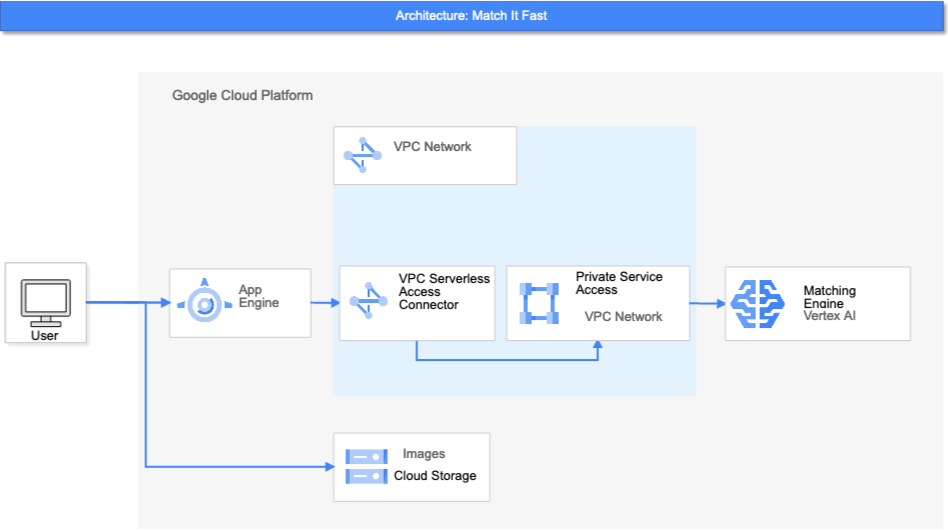

# MatchIt Fast

MatchIt Fast is the demonstration application with [Vertex Matching Engine](https://cloud.google.com/vertex-ai/docs/matching-engine/overview).

MatchIt Fast demonstrates the blazingly fast similarity search among several million images/articles using the [Vertex Matching Engine](https://cloud.google.com/vertex-ai/docs/matching-engine/overview).

https://matchit.magellanic-clouds.com/

## Architecture



## How it works

See 

## Preparation

### Google Cloud Platform Project

You need to have a Google Cloud Platform project with enabled billing account.

### Configuring Matching Engine

To create Indexes and deploy them to the Index Endpoints, see [the documentation](https://cloud.google.com/vertex-ai/docs/matching-engine/create-manage-index?hl=en).

MatchIt Fast app requires the two indexes of images and articles deployed to index endpoints.

The example command lines to create Matching Engine indexes for the MatchIt Fast demonstration are shown below.

```
gcloud --project=MY-PROJECT-ID ai indexes create \
       --display-name=gdelt-gsg \
       --description="GDELT GSG Demo" \
       --metadata-file=metadata/gdelt_gsg_index_metadata.json \
       --region=us-central1
gcloud --project=MY-PROJECT-ID ai indexes create \
       --display-name=wikimedia-images \
       --description="Wikimedia Image Demo" \
       --metadata-file=metadata/wikimedia_images_index_metadata.json \
       --region=us-central1
```

### GCE instance with container

To retrieve document embedding using the [Universal Sentence Encoder](https://tfhub.dev/google/universal-sentence-encoder/4), you need to deploy the container on the GCE instance.

The container image could be build with Cloud Build. The configuration for Cloud Built trigger is [utilities/containers/gsg-encoder/cloudbuild.yaml](utilities/containers/gsg-encoder/cloudbuild.yaml).

The [GCE instance with container](https://cloud.google.com/compute/docs/containers/deploying-containers) is handfull way to deploy container.

```
gcloud --project=MY-PROJECT-ID compute instances create-with-container INSTANCE-NAME \
    --zone=us-central1-a --machine-type=e2-medium \
    --image-family=cos-dev --image-project=cos-cloud --boot-disk-size=50GB \
    --container-image=gcr.io/MY-PROJECT-ID/universal-sentence-encoder-app:latest
```

## Run Demo Application

Running on the Google App Engine.

### 1. Configurations

Change the following setting values in app.yaml.

#### `env_variables`

| environment variable | description |
|----------------------|-------------|
| `MATCHING_ENGINE_DEPLOYED_INDEX_ID` | The deployed index ID for image search |
| `MATCHING_ENGINE_ENDPOINT_IP` | The IP address of deployed index for image search |
| `GDELT_GSG_DEPLOYED_INDEX_ID` | The deployed index ID for news search |
| `GDELT_GSG_ENDPOINT_IP` | The IP address of deployed index for news search |
| `GDELT_GSG_APP_ENDPOINT` | 'http://{IP-ADDR}' IP-ADDR should be replaced with the internal IP address of the GCE instance you created. |

### 2. Deploy

Perform the following gcloud command to deploy App Engine application in your GCP project.

```
gcloud --project YOUR-PROJECT-ID app deploy
```

### 3. Browse your application

After you deployed to App Engine, you can run the following command to launch your browser and view the app at https://[YOUR-PROJECT-ID].appspot.com:

```
gcloud app browse
```
