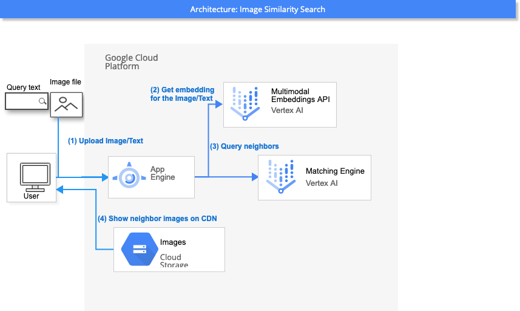
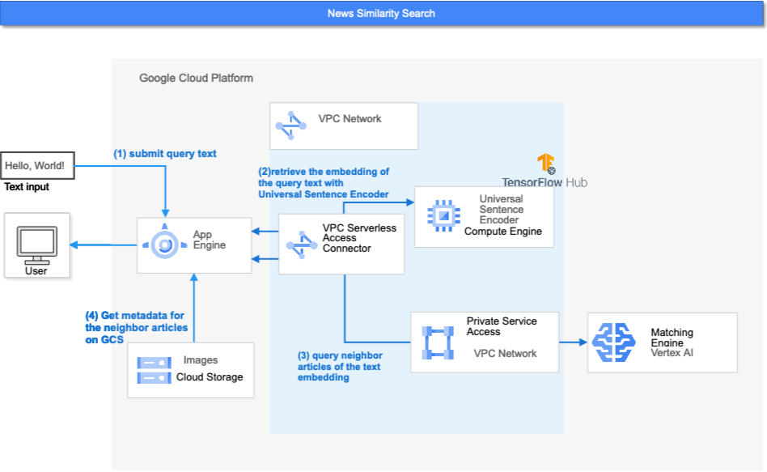

# How it works

Today vector embedding is the one of the most powerfull tools of ML engineers.
A wide variety of data including unstructured data (images, speech, natural languages etc...) can be expressed as collections of embedding by deep neural models and well designed tasks.
The neighbor search in the vector space is the popular problem to encorurage the use of embeddings to real world tasks: recommendation, search, classification etc.

MatchIt Fast is the demonstration application to show the suprisingly fast and scalable nearest neighbors search functionality of [Vertex Matching Engine](https://cloud.google.com/vertex-ai/docs/matching-engine/overview).
You can search among the 2 million images and 3.6 million articles with your own image and text.

This article show the architecture of the MatchIt Fast demo application.
If you want to know more details about the [Vertex Matching Engine](https://cloud.google.com/vertex-ai/docs/matching-engine/overview), see the documentation of Vertex AI.

## Image Similarity Search

The figure below shows the data flow when you upload custom image to search similar images on MatchIt Fast.

When you select your own image on your browser, MatchIt Fast app process it with [Vertex AI Embeddings API for Image](https://cloud.google.com/vertex-ai/docs/generative-ai/embeddings/get-image-embeddings).

The nearest neighbors search request is issued to the Matching Engine endpoints.

The neighbor images are directly downloaded to browser from CDN (public Google Cloud Storage bucket).

!Image Search by Text

When you input query text, MatchIt Fast app process it with [Vertex AI Embeddings API for Text](https://cloud.google.com/vertex-ai/docs/generative-ai/embeddings/get-text-embeddings).

The nearest neighbors search request is issued to the Matching Engine endpoints.

The neighbor images are directly downloaded to browser from CDN (public Google Cloud Storage bucket).

## News Similarity Search

The figure below shows the data flow when you submit query text to search similar articles on MatchIt Fast.

The embedding for the query text is generated by [Universal Sentence Encoder](https://tfhub.dev/google/universal-sentence-encoder/4) model.
The model size of Universal Sentence Encoder is abount 10x of the MobileNet V2, and the model load time is a bit long to deployed in App Engine applications.
We decide to deploy the model as server process on the GCE instance. The source code of container image of the Universal Sentence Encoder exists in [utilities/containers/gsg-encoder](../utilities/containers/gsg-encoder). See [README.md](../README.md) how to build container image and deploy on GCE instance.

Once the query text was converted into embedding, the application on App Engine issues nearest neighbors search request to Matching Engine endpoint as same as for image similarity search.
The query results contains the IDs of the neighbor articles. The application on App Engine get the metadata (title, url, language etc) of the articles from the bucket of Google Cloud Storage.

